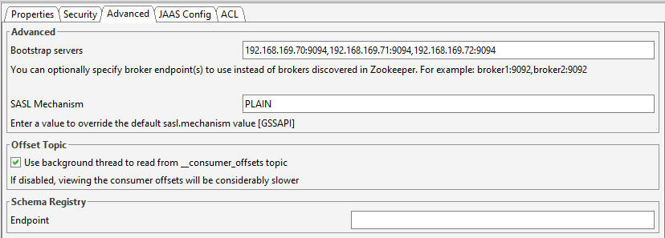

# inboundGW

*	“Inbound GW” will receive application messages from the client and send these messages to Kafka inbound topic.

# To install do the following steps
*  make sure that your nextork is 192.168.169.0/24
* install ubuntu desktop [Ubuntu 22.04.3 LTS]
* sudo apt update && sudo apt upgrade -y
* git clone https://github.com/mrefky/inboundGW.git
* cd ./inboundGW
* ./re_install.sh to iinstall microk8s with all required addons.
* use microk8s.inspect to see if there is anything needs corrections and follow the results [make sure that the local registory is conigured propoerly by adding the file /etc/docker/daemon.json].
* install docker (./install_docker.sh).
* install helm (./get_helm.sh && repo.sh).
* install k9s (./install_k9s.sh).
* using https://webinstall.dev/golang/ install go 1.21.5 (curl -sS https://webi.sh/golang | sh) 
* install kafka offset explorer if not installed.
* ./build.sh

# Statefullsets

# Pods

# Services

# Config Maps

# Offset-Explorer

# Testing

# Connection Parameters

* IP=192.168.169.62
* Port=5001
* TargetCompID=CASE
* SenderCompID=01001

